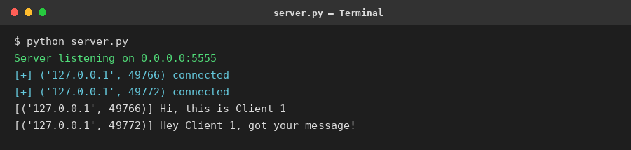
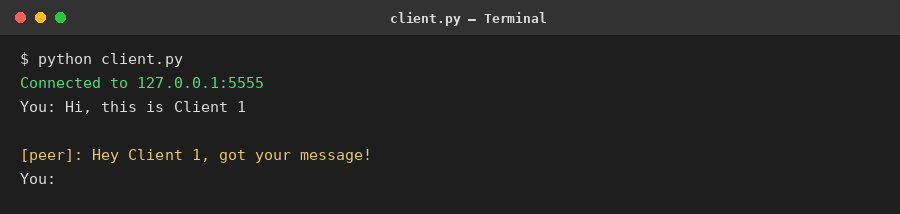
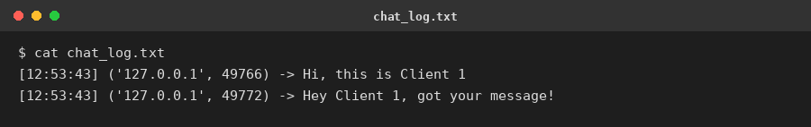

# Encrypted Chat App

Project 1 — SyntecxHub Cyber Security Internship

A simple client/server chat application where messages are encrypted with
**AES (AES-256-GCM)** before being sent over a **TCP** socket.

## Features
- TCP socket communication (client/server)
- AES-256-GCM symmetric encryption of every message
- Fresh random nonce/IV generated per message (safe IV usage)
- Pre-shared key (PSK) used by both sides to encrypt/decrypt
- Supports multiple clients at once (server uses threading)
- Every received message is logged with a timestamp to `chat_log.txt`

## Files
- `server.py` — starts the TCP server, accepts multiple clients, decrypts,
  logs, and relays encrypted messages to other connected clients
- `client.py` — connects to the server, encrypts and sends messages, and
  listens for incoming ones in the background

## How to Run
1. Install the one dependency:
   ```
   pip install cryptography
   ```
2. Start the server:
   ```
   python server.py
   ```
3. In a new terminal, start a client:
   ```
   python client.py
   ```
4. Open more terminals and run `python client.py` again to connect more
   clients — messages sent by one are relayed (encrypted) to the others.
5. Type `exit` in a client to disconnect.

## Demo Screenshots
| Server | Client | Log File |
|---|---|---|
|  |  |  |

## Notes
- The pre-shared key (`PSK`) is hard-coded for simplicity — in a real
  deployment you'd exchange it securely (e.g. Diffie-Hellman key exchange)
  instead of hard-coding it.
- AES-GCM is authenticated encryption, so it also detects tampering with
  the ciphertext, not just confidentiality.
