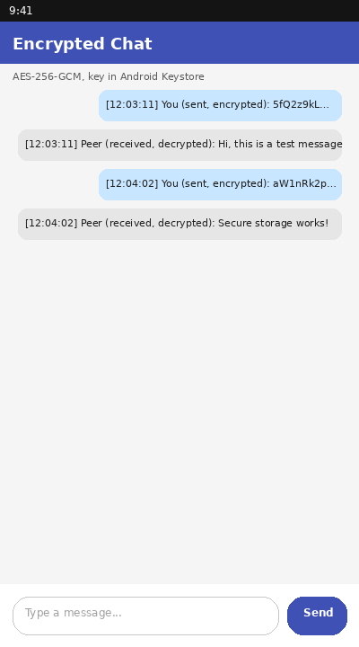

# Encrypted Android Chat

Project 2 — SyntecxHub Cyber Security Internship

An Android chat prototype that encrypts every message on the client using
**AES-256-GCM**, with the key held securely in the **Android Keystore**.

## Features
- Messages encrypted on-device with AES-256-GCM before being "sent"
- A fresh random IV/nonce is generated for every message (safe IV usage)
- Local encryption/decryption pipeline: type → encrypt → transmit → decrypt → display
- Secure key storage using the **Android Keystore** (see below)
- Basic UI: message input, Send button, scrolling message history
- Error handling around key generation, encryption, and decryption

## Project structure
```
EncryptedAndroidChat/
├── app/
│   ├── build.gradle
│   └── src/main/
│       ├── AndroidManifest.xml
│       ├── java/com/syntecxhub/encryptedchat/MainActivity.kt
│       └── res/
│           ├── layout/activity_main.xml
│           └── values/strings.xml
├── build.gradle
└── settings.gradle
```

## How to run
1. Open the `EncryptedAndroidChat` folder in **Android Studio** (File → Open).
2. Let Gradle sync (it will pull the AndroidX dependencies).
3. Run on an emulator or device (minSdk 23+).
4. Type a message and tap **Send** — you'll see the encrypted (Base64)
   version appear first, followed half a second later by the decrypted
   version, simulating the send → receive round trip.

> This is a single-device prototype (as the task asks for). "Sending" and
> "receiving" are simulated locally so the full encrypt/decrypt pipeline is
> visible without needing a live server. Swapping the simulated delay in
> `sendMessage()` for real socket/HTTP calls — using the same
> `encrypt()`/`decrypt()` functions — turns this into a real networked
> version like Project 1.

## Secure key storage — how it works, and the risks
The AES key is generated **inside** the Android Keystore
(`KeyGenParameterSpec` + `KeyGenerator.getInstance(..., "AndroidKeyStore")`).
That means:
- The raw key bytes never exist in app memory, in a file, or in a backup —
  only the Keystore (backed by hardware on most modern devices, e.g. a
  Trusted Execution Environment or Secure Element) can use the key.
- The app can ask the Keystore to encrypt/decrypt, but can never export
  the key itself.

**Risks / limitations to be aware of:**
- On older devices or those without hardware-backed Keystore support, keys
  may fall back to software-only storage, which is weaker.
- If the device is rooted or compromised at the OS level, Keystore
  guarantees can be reduced (though hardware-backed keys are still much
  harder to extract).
- This prototype doesn't set `setUserAuthenticationRequired(true)`, so the
  key can be used without the user unlocking/authenticating each time — a
  production app handling sensitive data should add that.
- Losing the device or app data (Keystore entries are tied to the app and
  device) means the key — and any messages encrypted with it — cannot be
  recovered. A real app needs a key backup/rotation strategy.

## Demo

